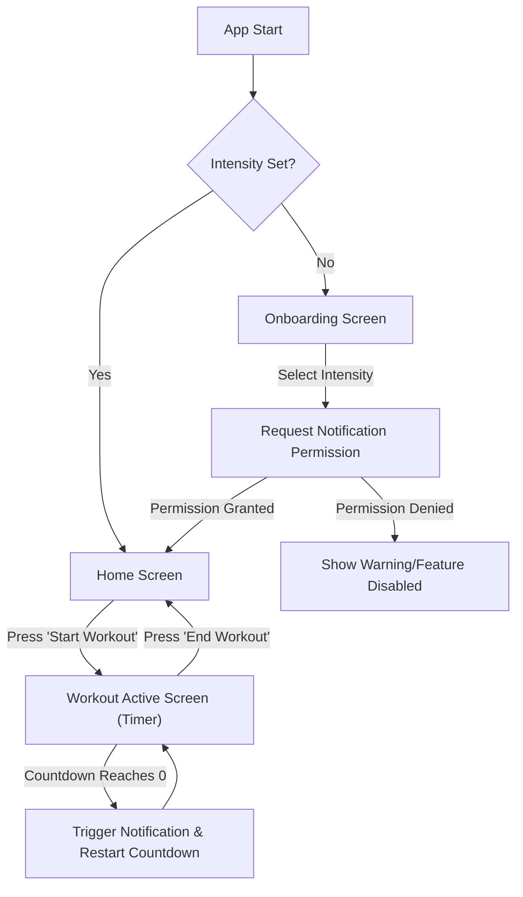
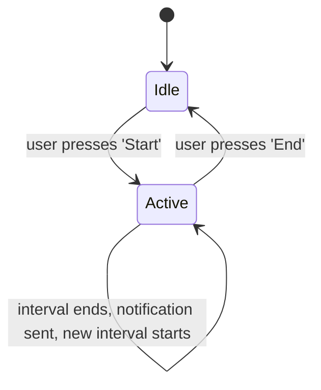

# MVP Modification Design: Water Intake Tracker

## 1. Overview

This document outlines the design for creating a Minimum Viable Product (MVP) of a water intake tracking application specifically for individuals who are working out. The application will be built within the existing Flutter project structure.

The core functionality is to remind users to drink water at appropriate intervals during their workout sessions. The app will feature a dark theme, a simple onboarding process to determine workout intensity, and a countdown timer system that triggers local notifications.

## 2. Detailed Analysis of the Goal

### User Need
Exercising individuals often need reminders to stay properly hydrated to maintain performance and health. This app addresses that need by providing timely, simple, and actionable notifications based on their workout intensity.

### Core Features
-   **Onboarding:** A single, straightforward screen to ask the user for their typical workout intensity: "Normal" or "Heavy". This choice is crucial as it dictates the notification logic. This screen will also handle the request for notification permissions.
-   **Main/Timer Screen:** A minimalist screen that serves as the main dashboard. It will feature a prominent button to "Start" and "End" a workout session. When a workout is active, this screen will display a live countdown timer until the next notification.
-   **Countdown & Notification Logic:**
    -   The app will not use a simple stopwatch. Instead, it will use a series of countdowns.
    -   When a workout starts, a random duration is chosen based on intensity:
        -   **Normal:** Randomly 10 or 15 minutes.
        -   **Heavy:** Randomly 15 or 20 minutes.
    -   A countdown timer for this duration begins.
    -   When the countdown reaches zero:
        1.  A local notification is triggered.
        2.  A new random countdown interval starts immediately.
    -   This loop continues until the user manually ends the workout.
-   **Notification Content:**
    -   The notification will be handled by the `flutter_local_notifications` package.
    -   The message will be: `"ถึงเวลาจิบน้ำแล้ว! แนะนำให้ดื่ม [X] เพื่อรักษาสมดุลร่างกาย"`
    -   The quantity `[X]` will be represented by images:
        -   **Normal (3-4oz):** 1 glass icon (using the `lib/assets/bottle4oz.jpeg` asset).
        -   **Heavy (8oz):** 2 glass icons (displaying the same asset twice).
-   **Persistence:** The user's chosen workout intensity will be saved locally using `shared_preferences` so they don't have to select it every time they open the app.
-   **UI/UX:** A dark, minimalist, and focused user interface.

## 3. Alternatives Considered

-   **Background Service for Timer:** Using a full foreground service (e.g., via `flutter_background_service`) to maintain a continuously running timer in the background.
    -   **Reason for Rejection:** This approach is overly complex and battery-intensive for an MVP. The primary requirement is the timely delivery of notifications, which can be achieved more efficiently by scheduling them with the native OS. Our chosen method (calculating a future `DateTime` and scheduling a notification for that time) is the standard, reliable, and battery-friendly solution for this use case.
-   **Cumulative Stopwatch Timer:** A timer that counts up from zero.
    -   **Reason for Rejection:** The user provided a clear requirement for a countdown timer that resets after each hydration interval.

## 4. Detailed Design

### Architecture
We will adopt a simple, service-oriented architecture using `ChangeNotifier` and `Provider` for state management, which is well-suited for an MVP.

-   **`lib/main.dart`**: Entry point. Configures the dark theme, and sets up routing.
-   **`lib/screens/onboarding_screen.dart`**: First-time user setup screen.
-   **`lib/screens/home_screen.dart`**: Main screen for starting/stopping workouts and viewing the timer.
-   **`lib/services/notification_service.dart`**: A wrapper for all `flutter_local_notifications` logic.
-   **`lib/services/workout_service.dart`**: The core business logic using `ChangeNotifier` to manage workout state, timer, and intervals.
-   **`lib/services/storage_service.dart`**: A wrapper for `shared_preferences` to handle data persistence.

### State Management (`WorkoutService` with `ChangeNotifier`)
The `WorkoutService` will be the single source of truth for the workout state. The UI will use a `Consumer` or `Provider.of<WorkoutService>(context)` to listen to changes and rebuild.

### UI and Component Breakdown
-   **Onboarding Screen (`onboarding_screen.dart`):**
    -   A `Scaffold` with a dark theme.
    -   A `Text` widget asking for workout intensity.
    -   Two `ElevatedButton`s ("ปกติ", "หนัก").
    -   On press:
        1.  Call `NotificationService.requestPermissions()`.
        2.  If permission is granted, call `StorageService.saveIntensity()` with the selection.
        3.  Navigate to the `HomeScreen`, replacing the current screen.
-   **Home Screen (`home_screen.dart`):**
    -   `Scaffold` with dark theme.
    -   A large, central `Text` widget to display the countdown timer (format `MM:SS`).
    -   Below the timer, display the water intake suggestion with the bottle image(s).
    -   A large `FloatingActionButton` or similar prominent button to toggle the workout state (`Start`/`End`).

### Service Logic
-   **`NotificationService`:**
    -   `init()`: Initializes the notification plugin.
    -   `requestPermissions()`: Handles the platform-specific logic for requesting user permission for notifications.
    -   `scheduleNotification(scheduledTime, title, body)`: Schedules a single notification to be delivered at a precise time.
    -   `cancelAllNotifications()`: Clears any scheduled notifications when a workout is ended.
-   **`WorkoutService` (extends `ChangeNotifier`):**
    -   `WorkoutIntensity? intensity`: The user's selected intensity.
    -   `bool isWorkoutActive`: The current state of the workout.
    -   `Duration remainingTime`: The current countdown duration.
    -   `Timer? _timer`: The internal `dart:async` timer for updating the UI every second.
    -   `startWorkout()`: Sets `isWorkoutActive` to true, starts the first countdown interval, and notifies listeners.
    -   `stopWorkout()`: Sets `isWorkoutActive` to false, cancels the `_timer` and all scheduled notifications, and notifies listeners.
    -   `_startNewCountdownInterval()`:
        1.  Calculates the random duration (e.g., 10 or 15 mins).
        2.  Sets `remainingTime` to this duration.
        3.  Calculates the exact `scheduledTime` in the future.
        4.  Calls `notificationService.scheduleNotification()` for that future time.
        5.  Starts the `_timer` to tick every second, decrementing `remainingTime` and calling `notifyListeners()` to update the UI. If the timer hits zero, it automatically calls this method again to start the next interval.

## 5. Diagrams

### User Flow

### Workout State Diagram

## 6. Summary of Design

The design uses a clean, service-oriented architecture with `ChangeNotifier` for simple state management. It correctly interprets the user's requirements for a countdown-based interval system and solves the background execution challenge efficiently by leveraging the OS's native notification scheduling capabilities. The user flow is minimalist, focusing on getting the user into a workout session with minimal friction.

## 7. References

-   **flutter_local_notifications:** [https://pub.dev/packages/flutter_local_notifications](https://pub.dev/packages/flutter_local_notifications)
-   **Simple state management (Provider):** [https://flutter.dev/docs/development/data-and-backend/state-mgmt/simple](https://flutter.dev/docs/development/data-and-backend/state-mgmt/simple)
-   **Timer class (Dart):** [https://api.flutter.dev/flutter/dart-async/Timer-class.html](https://api.flutter.dev/flutter/dart-async/Timer-class.html)
-   **shared_preferences:** [https://pub.dev/packages/shared_preferences](https://pub.dev/packages/shared_preferences)
